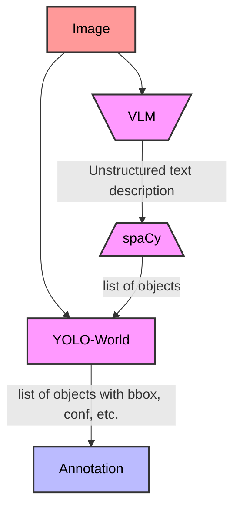
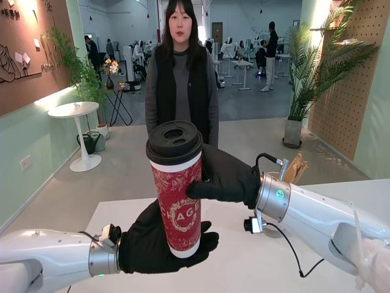
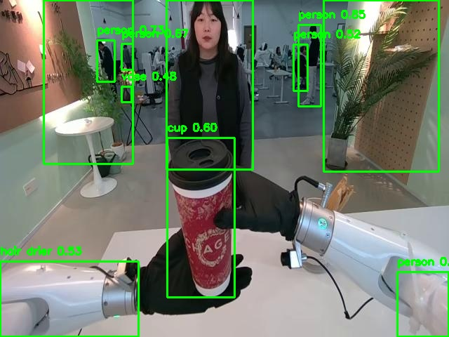
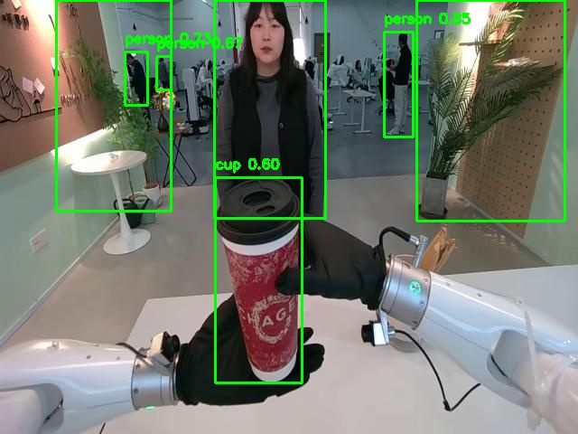
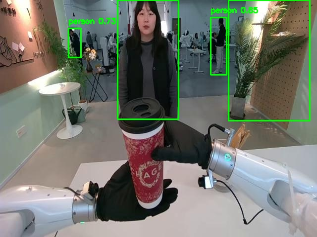
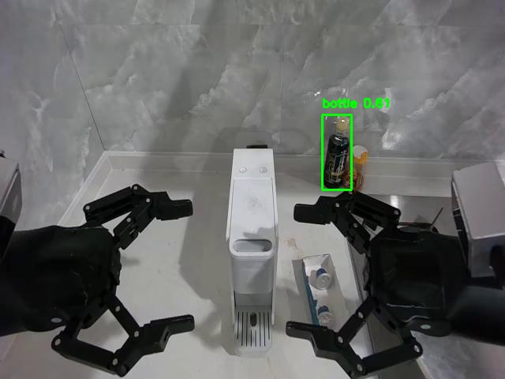
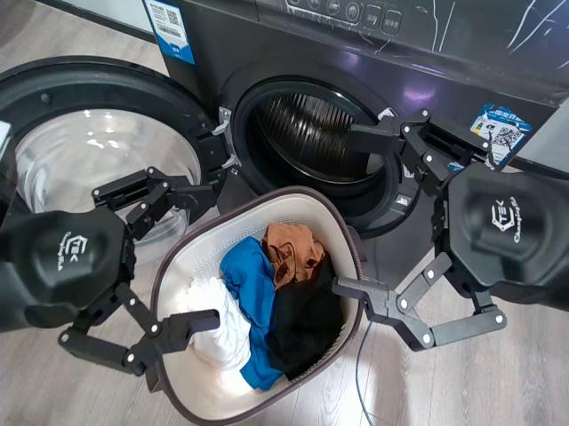
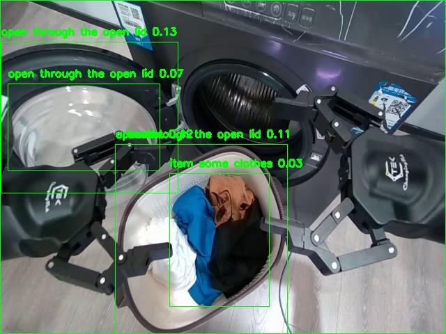
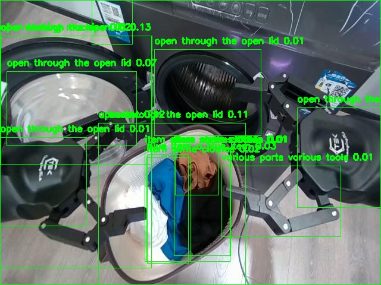
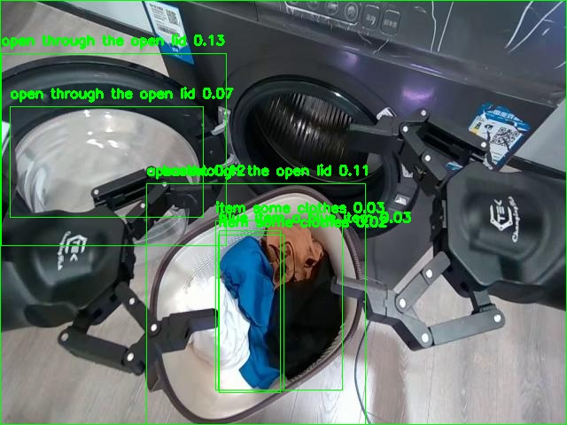

# Annotation Pipeline

> [!WARNING]
> All scripts and python files should be executed from the project's root if the opposite is not stated explicitly

## Task

Develop a pipeline for automatic image markup using available machine learning models. The implementation must be done in Python

#### Assumptions

- Annotation is performed offline, so we may focus more on accuracy rather than time.

## Solution / Pipeline



## Experiments

### YOLO

Variate detection confidence

|                       initial                       |                                  0.4                                  |                                  0.55                                   |                                  0.7                                  |
| :-------------------------------------------------: | :-------------------------------------------------------------------: | :---------------------------------------------------------------------: | :-------------------------------------------------------------------: |
|  |  |  |  |

### YOLO Problems

Main default YOLO problems are the lack of support for rare objects classes that would frequently appear in free environment of a robot.

The minimum confidence for all images here is 0.0, meaning that YOLO even don't try to detect them.

|                                                                                      |                                                      |
| ------------------------------------------------------------------------------------ | ---------------------------------------------------- |
| Does not detect main object of interaction                                           |  |
| Unable to handle such an easy case for human to detect clothes in bag before laundry |            |

### YOLOWorld


Changing detection model to [YOLOWorld](https://docs.ultralytics.com/models/yolo-world/) helped a lot due to its nature to find default classes using CLIP text encoder to embed custom classes and further detect them on image.

|                        initial                         | YOLOWorld                                                            |
| :----------------------------------------------------: | -------------------------------------------------------------------- |
|  |  |

### YOLOWorld Problems

One of the firstly observed problems is much lower minimum confidence level needed for detecting custom classes. So, here number of detected bounding boxes for provided classes `["open through the open lid", "a basket", "a close-up view", "item some clothes"]` are changing a lot after changing even on `0.01`.

|                        initial                         |                                 0.01                                  |                                 0.02                                  |                                 0.03                                 |
| :----------------------------------------------------: | :-------------------------------------------------------------------: | :-------------------------------------------------------------------: | :------------------------------------------------------------------: |
|  |  |  |  |

Calling other problems it should be mentioned that for such a small probabalities there are sometimes repeated bounding boxes of the same object.

|                                                                                                                                                        |                                                                       |
| ------------------------------------------------------------------------------------------------------------------------------------------------------ | --------------------------------------------------------------------- |
| _"open through the open lid"_ bboxes refers to the same object (`Non-Maximum Suppression` is needed)                                                   |   |
| You may see a bbox around the picture which is of class _"a close-up view"_ which definetely should not be considered. (`Filtering by area` is needed) |  |

## Structure

```
.
├── configs
│   └── default.yaml
├── data
│   ├── processed
│   └── raw
├── examples
│   ├── annotated_sample.jpg
│   ├── sample.jpg
│   └── sample.json
├── scripts
│   ├── data.sh
│   ├── mlflow.sh
│   └── pipeline.sh
├── src
│   ├── description.py
│   ├── detection.py
│   ├── objects.py
│   └── utils.py
├── main.py
├── pyproject.toml
├── README.md
├── uv.lock
```

## Data

```
├── data
│   ├── processed
│   └── raw
```

Use script to unzip archive with jpgs and place it in data/raw.

```bash
bash scripts/data.sh <.zip>
```

## Execute pipeline

```bash
uv sync
```

Serve mlflow for experiments tracking

```bash
bash scripts/mlflow.sh
```

Execute the annotation pipeline itself

```bash
bash scripts/pipeline.sh
```

## Test on one sample

To test on 1 sample use

```bash
uv run main.py --input_dir examples --output_dir examples
```

## Dev

Includes ruff, pre-commit utilites

```bash
uv sync --dev
```

```bash
uvx pre-commit install
```

## Criterions

#### Object Descriptions Accuracy & Depth

> ![NOTE]
> Not ready yet, plan to implement

1. Use BERTScore with earlier predefined ground truth descriptions
2. Make a list of main objects on each image and compute precesion / recall/ f1 on extracted objects appeareance

#### Object Relations Accuracy

> ![NOTE]
> Not ready yet, plan to implement

#### Bboxes Accuracy

<!-- https://github.com/orgs/commun ity/discussions/16925 -->

> ![NOTE]
> Not ready yet, plan to implement

1. Sample N images from distinct robot's environments
2. Manually annotate these images
3. Evaluate pipeline on this validation set by computing IoU with expected bounding boxes

#### Open Source Models

| Stage                                        | Model                  | Link                                                              |
| :------------------------------------------- | :--------------------- | :---------------------------------------------------------------- |
| 1. Image description via VLM                 | Qwen2.5-VL-7B-Instruct | [huggingface](https://huggingface.co/Qwen/Qwen2.5-VL-7B-Instruct) |
| 2. Objects extraction from unstructured text | spaCy                  | [spacy](https://spacy.io/models/en)                               |
| 3. Objects detection                         | YOLO-World             | [ultralytics](https://docs.ultralytics.com/models/yolo-world/)    |

#### Annotation Validation & Improvements

> ![NOTE]
> Not ready yet, plan to implement

1. Similar to Bboxes accuracy but extend with validation of extracted objects
2. Use LLM instead of spaCy model to extract objects from unstructred text
3. **OR** try structred output from VLM
